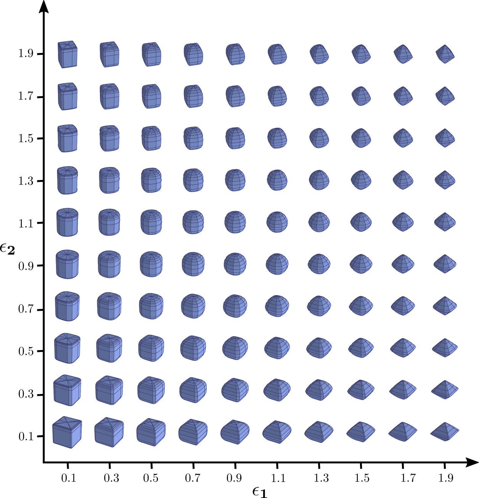

# SuperQ-GRASP
Codes for the paper SuperQ-GRASP at [https://arxiv.org/abs/2411.04386]

# Preliminary - Superquadrics
Superquadrics are a family of primitve shapes parameterized by this formula: 

$$
\left(\left(\frac{x}{a_x}\right)^{\frac{2}{\varepsilon_2}} + \left(\frac{y}{a_y}\right)^{\frac{2}{\varepsilon_2}}\right)^{\frac{\varepsilon_2}{\varepsilon_1}} + \left(\frac{z}{a_z}\right)^{\frac{2}{\varepsilon_1}} = 1
$$


Here, the hyperparameters $a_x, a_y, a_z$ determine the size, while $\varepsilon_1$ and $\varepsilon_2$ determine the shape. Simple as it appears, the formula can cover a range of different shapes, from cubic-like to cylinderic-like.


# Installation
In pratice, the repo is validated at Ubuntu 24.04 LTS. However, all the implementaions are based on docker engine, so hopefully it could be deployed and validated on other environments as long as docker engine is supported.

Also, GPU support from Nvidia is expected. So, a GPU driver is expected on the host machine. However, there is no need to install any additional library on the host machine, including cuda or pytorch, because the provided scripts will install them within the docker image building process. 

## Step 1: Docker engine installation
Please follow the [guidance](https://docs.docker.com/engine/install/ubuntu/) to install the docker engine. Also, please complete the post-installing steps so that "sudo" won't be required for docker-related commands.

Then, follow this [guidance](https://docs.nvidia.com/datacenter/cloud-native/container-toolkit/latest/install-guide.html) to provide GPU support to docker containers. Remember to restart docker engine at the end to update the changes. 

(Optional but highly recommended) We develop the program using Vscode with docker extension. It's recommended to install docker extension on VScode and attach to a running container to develop the program. 

## Step 2: Docker Image Build & Container Construction
To build the docker image, clone this repo. Under the root directory of the repo, type

```
source docker/build.noetic.sh
```

Type 'docker images' to validate the existence of the docker image. Then, to construct a docker container, type

```
source docker/run.noetic.sh
```

Now, you should expect to see one container called "SuperQ-GRASP" by typing

```
docker ps -a
```


**The following operations are ALL in the docker container.**

## Step 3: Environmental Setup
Go inside the docker container, and go tothe repo directory 

(Optional but recommended) Follow the steps in VScode. 

```
cd /repo/SuperQ-GRASP
```

Type 'nvidia-smi' to validate that you have gpu access. 

Configure the virtual python environment by typing

```
source setup.sh
```

This will create a virtual environment called "spot" with all the libraries configured. 

Next, we need to install these needed libraries in order:
<ol>
	<li>cmake (>=3.21.0): 'source bash_scripts/install_cmake.sh'. Type 'cmake --version' to validate the cmake version (>=3.21.0)</li>
	<li>instant-NGP: 'source bash_scripts/instant-ngp.sh'. Type './instant-ngp/instant-ngp --scene ./instant-ngp/data/nerf/fox' to validate the installation. You should expect to see a 3D fox figure in the window popped out </li>
	<li>GroundingDINO: 'source bash_scripts/GroundingDINO.sh'. Type 'python3 utils/test_grounding_dino.py' to download the weights and validate the effectiveness. </li>
	<li>LoFTR: 'source bash_scripts/loftr.sh'. Then, you need to manually download the weights at "./LoFTR/weights/outdoor_ds.ckpt". Please follow the instructions on the official [repo](https://github.com/zju3dv/LoFTR?tab=readme-ov-file) and download the weights from their [drive](https://drive.google.com/drive/folders/1DOcOPZb3-5cWxLqn256AhwUVjBPifhuf) </li>
	<li>(Optional, only if you hope to see the baseline performance) Contact-GraspNet: 'source bash_scripts/contact_graspnet.sh'</li>
</ol>

# Experiments
## Step 4: Experiments on SuperQ-GRASP
Please download the [dataset](https://drive.google.com/drive/folders/1pNuiV0qzxnzdXVDubmjL20QCAzvZLrGu?usp=drive_link) via Google Drive to the root. Remember to unzip the data folder. 

The dataset of one object consists of one NeRF snapshot in the format of '.ingp' from instant-NGP and one json file to describe camera intrinsics. Our pipeline will automatically extract out mesh from them and complete the necessary preprocessing task. As an example, suppose we want to test our method on chair2_real. At first, preprocess the data by:

```
python3 preprocess.py ./data/chair2_real --snapshot base.ingp --taubin-smooth 5 --camera base_cam.json --distance 1.5 --image-screenshot-nerf
```

This preprocessing only needs to be done once (70-90s).The explanation for several hyperparameters:
<ol> 
	<li> 'image_screenshot_nerf': this attribute is related to the camera pose estimation process in real-world experiments. We have adopted a pose estimation method that requires camera frames with ground-truth poses. Those image frames can be captured by virtual cameras in NeRF, or real-world cameras during 3D scene reconstruction process. So far, '--image_screenshot_nerf' is set to be true and only the former method is used. </li>
	<li>'distance': the 'distance' attribute is the radius of the semi-sphere around the object. It is only used when 'image_screenshot_nerf' is true. This is the distance where virtual cameras will be placed to capture images with ground-truth poses on the target object in NeRF. These images with ground-truth poses will be used to estimate the camera poses in real-world experiments. Thus, It should be close to the distance between the robot and the object times the scale. For example, if your robot is approximately 2 meters away from object. Then, you should set up the distance value to be 2. The smaller the difference is, the better the pose estimation results might be.</li>
	<li>'camera': this attribute specify the intrinsic parameters of the camera. Notice that it also specifies the so-called "nerf-scale" attribute, which is used to solve up the scale ambiguity between the nerf scene and real-world scene. For example, if a rod is of 5 units length in nerf, and 2 meters in real world, then the nerf scale is 2.5. </li>
</ol>


And then, you could test the grasp pose evaluation module (SuperQ-GRASP) by calling

```
python3 grasp_pose_prediction/grasp_sq_mp.py ./data/chair2_real --camera base_cam.json --click --visualization
```

It will produce an image for the user to select the graspable region. Then, grasp poses will be generated around the graspable region.

Alternatively, you could select the specific superquadric to generate valid grasp poses. Just type

```
python3 grasp_pose_prediction/grasp_sq_mp.py ./data/chair2_real --camera base_cam.json --region_select --visualization
```

Follow the prompts and valid grasp poses can be obtained on the selected region. 

(Optional) If you have installed Contact-GraspNet as well, you could test the two baseline methods by comparing them against the proposal method. At first, there is one small environmental setup issue to be fixed. Go to 

```
cd contact_graspnet_pytorch/contact_graspnet_pytorch
```

Open 'visualization_utils_o3d.py' and replace line 13 with

```
import contact_graspnet_pytorch.mesh_utils as mesh_utils
```

Then, go to the root directory of the repo

```
cd ../../
```

Type

```
python3 baseline_comparison.py ./data/chair2_real --distance 4 --nerf-scale 2.5 --iterations-per-method 2 --visualization
```

'iterations-per-method' will define the number of iterations to evaluate grasp poses at the specified camera pose for each of the method. If visualization flag is activated, then within one iteration, you should expect to see: 
<ul>
	<li>SuperQ-GRASP: there will be only one window popping out showing the results. 
	<li>Contact GraspNet: there will be two windows popping out, one for the raw results from Contact GraspNet and the other for the same result after evaluation. </li>
	<li>Contact GraspNet + Depth: there will be two windows popping out, one for the raw results from Contact GraspNet on the single-view depth data and the other for the same result after evaluation. </li>
</ul>
If you want to see complete quantitative results, please check line 142 in 'baseline_comparison.py'. By default, it only shows one comparison experiment as a demonstration. 

## Step 5: Experiments on real robot

At first, within the virtual environment, please access the SPOT robot by 

```
source spot_connect.sh
```

Now, still take Chair2_real as an example. If you hope to grasp the chair in front of the robot:

You could type 

```
python3 grasp_target_obj.py 192.168.80.3 --nerf_model ./data/chair2_real --visualization
```

The robot will stand up, approach the object prompted by the language guidance, and complete the entire grasping process. 

**NOTE** According to our experiments, if your robot fails to grasp the object, it may probably be because of the inaccurate result from the pose estimation, instead of the flaw of the grasp pose estimation module. You can manually set up the pose by yourself from real-world measurements. For example, there is one section provided in the program for you to manually force the estimated gripper height to match the real-world measurement. 
